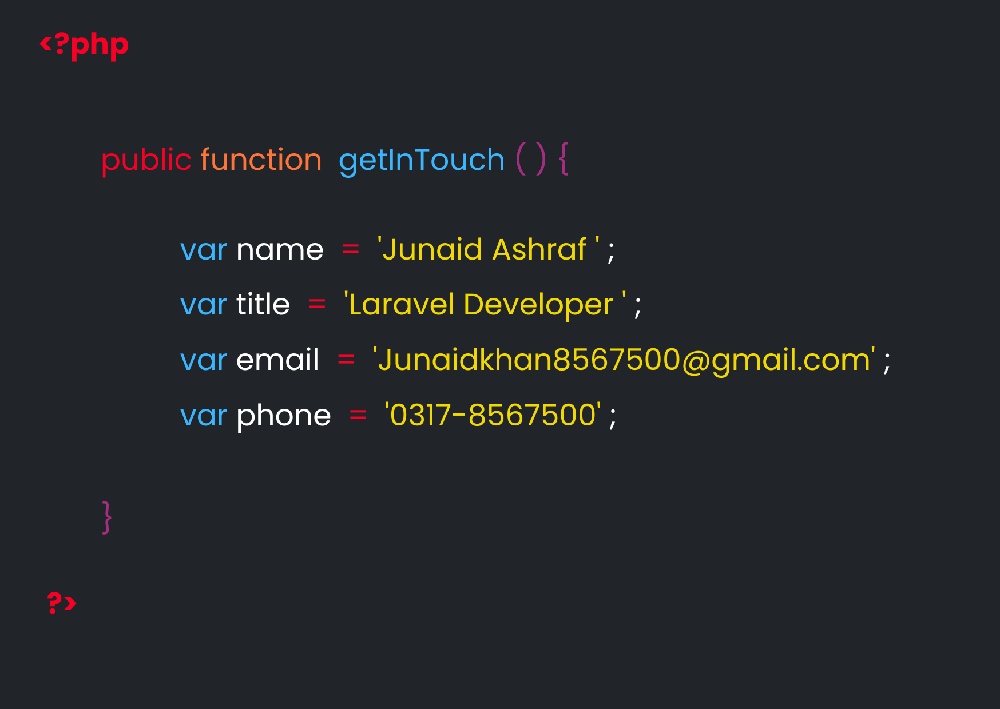

 

  

<!-- # 👨‍💻 Muammar Siddiqui | PHP/LARAVEL DEVELOPER -->
 

<!--  -->

<h3 align="center">Full Stack Web and App Developer</h3>

  
  

  

## About Me

Hey there! I'm Junaid Ashraf, experienced full-stack PHP Laravel developer with a proven track record in designing and implementing scalable web applications. Proficient in both front-end and back-end development, adept at creating efficient and robust solutions.

<!--  -->

- 💼 **Professional Experience:** 2 years

- 🚀 **Expertise:** Php/Laravel, Ajax, Javascript, MySQL, Web APIs, Backend Development.

- 🛠 **Technologies:** PHP/Laravel, SQL Server, HTML/CSS, Angular CLI, Bootstrap, ASP .NET CORE, HTML/CSS, MySQl

- 🌐 **Cross-platform Enthusiast:** Proficient in different versions of .Laravel 

- 🌱 I’m currently learning **.Vue Js, .Net Core, Angular CLI**

- 💬 Ask me about **PHP, Laravel, MySql, web development, full stack development, backend**

- 📫 How to reach me **Junaidkhan8567500@gmail.com**
 

---

## Find me at

---

## 📌 Languages

  
  
  
  
  
  
  
  
  
  

## 🧰 Frameworks and libraries
### Frontend Technologies

  
  
  
    
  {/*  */}
  {/*  */}
  {/*  */}
  
   

### Backend / Full Stack Technologies

  
  
  

### Database

  
  
  
  

  

  

## 📌 GitHub Stats

  

 

  

